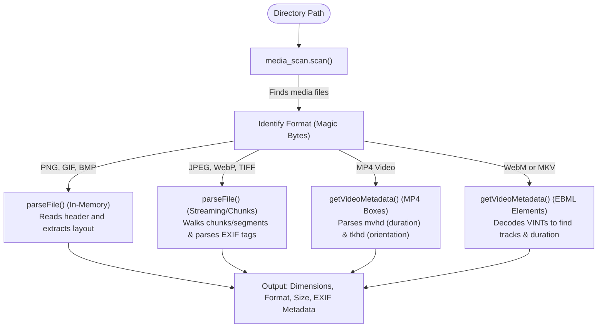

# Developer & Agent Guide: Project Architecture

This document details the internal design, directory layout, parsing flow, and coding principles of `zprobe`. It serves as a guide for developer agents and human contributors working on or extending this codebase.

## Project Architecture

`zprobe` scans a target directory recursively for media files, parses their binary headers, and outputs metadata (dimensions, file formats, and sizes) as plain text or structured JSON.

### Directory Structure

```text
src/
├── core/       # Byte reader, SQLite cache interface
├── crawler/    # Filesystem scanner and crawler logic
├── formats/    # Image and video binary header parsers
│   ├── images/ # Parsers for BMP, GIF, JPEG, PNG, TIFF, and WebP
│   └── videos/ # Parsers for MP4 (ISOBMFF) and WebM/MKV (EBML)
└── web/        # Embedded dashboard assets
```

### Parse Flow



### Key Design Principles

1. **Explicit Memory Allocation**: All heap allocation is explicit. If any step fails during parsing or directory iteration, Zig's `errdefer` mechanism ensures allocated paths and buffers are completely freed.
2. **Bounds Protection**: All parsing leverages `ByteReader` which performs bounds checking on every read/skip operation, avoiding vulnerabilities like buffer overflows on malformed inputs.
3. **Zero-Copy / Small Buffer Parsing**: Fixed-header formats (PNG/GIF/BMP) are parsed using a single small read. Streaming formats (JPEG, MP4, EBML) are traversed dynamically using positional reads (`readPositionalAll`) to avoid loading large media streams into memory.
4. **Concurrent I/O Parallelization**: Scanning and metadata parsing are separated into a fast, sequential path scanner followed by a concurrent worker thread pool. The pool size dynamically clamps between 8 and 16 based on core count to parallelize disk seeks. Output is synchronized using mutexes, and allocations are isolated in per-task arena allocators to eliminate global heap lock contention.
5. **SQLite Concurrency & Aggregations**: The cache database runs in Write-Ahead Log (`WAL`) mode with a busy timeout of 5 seconds to ensure the crawler CLI and dashboard server can safely interface concurrently. The stats dashboard is populated using single-pass grouping queries computed inside SQLite and cached in-memory with a short TTL (2 seconds) to avoid transferring large collections or running redundant scans.
6. **Thread Pool Web Handlers**: Incoming TCP connections are dispatched to a pre-allocated worker thread pool (recycling threads based on CPU count) to eliminate connection thread spawning overhead. Static assets are served asynchronously, while SQLite read queries are parallelized using a shared Read-Write Lock (`RwLock`) on the database handle, ensuring optimal concurrency for concurrent dashboard readers.
