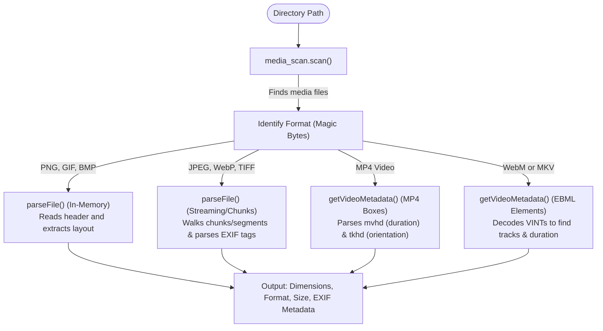

# Developer & Agent Guide: Project Architecture

This document details the internal design, directory layout, parsing flow, and coding principles of `zprobe`. It serves as a guide for developer agents and human contributors working on or extending this codebase.

For detailed architecture decision records and deep dives, see the [`docs/`](docs/README.md) suite:
* [Language Selection & Trade-offs](docs/language-selection-and-tradeoffs.md) (Zig vs. Rust vs. Go vs. C++)
* [Binary Parsing & Bounds Safety](docs/binary-parsing-and-bounds-safety.md) (Defensive TLV decoding)
* [Memory Management & Arena Lifecycles](docs/memory-management-and-arenas.md) (Zero-GC per-task arenas)
* [SQLite WAL & Worker Concurrency](docs/sqlite-wal-and-concurrency.md) (Multi-threaded database caching)
* [Content-Keyed Artifacts & Caching](docs/content-keyed-artifacts-and-caching.md) (Fast hashing and deduplication)

## Verification Methods

- `zig build test` for logic correctness
- `zig build release-all` for cross-compile correctness
- `zig fmt --check src/` for backend code style
- `prettier --check src/web` for frontend code style
- `chrome-devtools-mcp` or builtin browser for UI styles

## Project Architecture

`zprobe` scans a target directory recursively for media files, parses their binary headers, and outputs metadata (dimensions, file formats, and sizes) as plain text. The codebase is organized under `src/` by functional layer (`cli`, `core`, `crawler`, `formats`, `server`, `web`).

### Parse Flow

```mermaid
flowchart TD
    Path(["Directory Path"]) --> Scan["media_scan.scan()"]
    Scan -->|"Finds media files"| File["Identify Format (Magic Bytes)"]

    File -->|"PNG, GIF, BMP"| MemImg["parseFile() (In-Memory)
    Reads header and extracts layout"]

    File -->|"JPEG, WebP, TIFF"| StreamImg["parseFile() (Streaming/Chunks)
    Walks chunks/segments & parses EXIF tags"]

    File -->|"MP4 Video"| MP4["getVideoMetadata() (MP4 Boxes)
    Parses mvhd (duration) & tkhd (orientation)"]

    File -->|"WebM or MKV"| EBML["getVideoMetadata() (EBML Elements)
    Decodes VINTs to find tracks & duration"]

    MemImg --> Out["Output: Dimensions, Format, Size, EXIF Metadata"]
    StreamImg --> Out
    MP4 --> Out
    EBML --> Out
```

### Key Design Principles

1. **Explicit Memory Allocation**: All heap allocation is explicit. Use `errdefer` to ensure allocated paths and buffers are completely freed on error.
2. **Bounds Protection**: All binary parsing must use `ByteReader` with bounds checking on every read/skip operation to prevent buffer over-reads.
3. **Zero-Copy & Positional Streaming**: Parse fixed-header formats (PNG, GIF, BMP) with single small reads; traverse variable streaming formats (JPEG, MP4, EBML) dynamically via `readPositionalAll` to avoid loading full media into memory.
4. **Concurrent I/O Parallelization**: Scanning uses a sequential path discovery pass followed by a concurrent worker pool (default 8–16 threads, overridable via `-j`). Output is mutex-synchronized, and thread allocations are isolated in per-file arenas to avoid global heap contention.
5. **SQLite Concurrency & Aggregations**: The cache DB runs in Write-Ahead Log (`WAL`) mode with a 5-second busy timeout for concurrent CLI/server access. Dashboard statistics use single-pass SQL grouping queries cached in memory with a 2-second TTL.
6. **Thread Pool Web Handlers**: TCP connections dispatch to a pre-allocated worker thread pool. Static assets serve asynchronously, and SQLite read queries run concurrently through a shared `RwLock` on the database handle.
7. **Relational Schema & Decoupled Caching**: Metadata (`media_metadata`, keyed by `file_hash`) is decoupled from physical paths (`media_paths`). Enforce foreign keys and cascading triggers (`cleanup_orphan_metadata`) to automatically prune orphaned metadata when referencing paths are deleted or updated.
8. **Fast Content Hashing & Pruning**: Duplicate detection uses `computeFastHash` (SHA-256 over size, head 100KB, tail 100KB for files $\ge 2\text{ MB}$; full read for smaller). Use `--prune` to transactionally delete stale database paths.
9. **Optional HTTP Basic Authentication**: Basic auth is supported via `ZPROBE_AUTH_USER` and `ZPROBE_AUTH_PASS`. Credentials decode on the stack (zero-heap, memory-safe) before route authorization.
10. **Static Table Layout for Resize Performance**: The catalog table must use `table-layout: fixed` with explicit percentage widths on `#th-path`, `#th-date`, `#th-size`, `#th-format`, and `#th-dimensions`. Name and path cells must keep `text-overflow: ellipsis` and `white-space: nowrap`. Never revert to `table-layout: auto`, `overflow-wrap: anywhere`, or `clamp()` padding to prevent full-page resize reflows.
11. **Content-Keyed Previews & Format Alignment**: Previews and thumbnails are keyed strictly by 64-hex content hash (`computeFastHash`), never by path or synthetic stems. Layout: `.zprobe_thumbnails/<aa>/<bb>/<hash>.jpg` and `.zprobe_animations/<aa>/<bb>/<hash>.gif` (writers must `createDirPath` parent). Never set `has_thumbnail` or `has_animated` without a filesystem `stat`. Video extensions (`mp4, m4v, webm, mkv, mov, avi, wmv, flv`) must remain unified across scanner, SQL queries, and frontend routing.
12. **Lock-Free Atomic Performance Profiling**: Metrics use lock-free atomic counters (`std.atomic.Value(u64)`) and a zero-heap `MonotonicTimer` (`.awake`). Profiling checks guard all timing hooks to ensure zero runtime overhead when `--profile` is omitted.
13. **Class-Based CSS over ID Selectors**: Target CSS rules with classes rather than IDs to keep specificity low, while retaining element `id` attributes for DOM queries. The only CSS ID exceptions are table header widths (`#th-path`, etc.) required by Rule 10.
14. **CSS Design Token Discipline**: Colors, radii, spacing, transitions, and z-indices must reference tokens from `variables.css` (e.g. `var(--white)`, `var(--radius-sm)`). Never use hardcoded hex colors or magic pixel radii; define new tokens in `variables.css` first.
15. **Compile-Time Asset Registration**: The web frontend has no runtime bundler. Any added, renamed, or deleted CSS/JS file must be registered in `src/web/assets.zig` (`styles_css` or `app_js`) in dependency order.
16. **Modal & Overlay Event Ownership**: Modal-specific listeners (Escape key, focus trapping, backdrop clicks) must be bound/unbound dynamically by each modal's lifecycle function, never registered as permanent global listeners in `main.js`.
