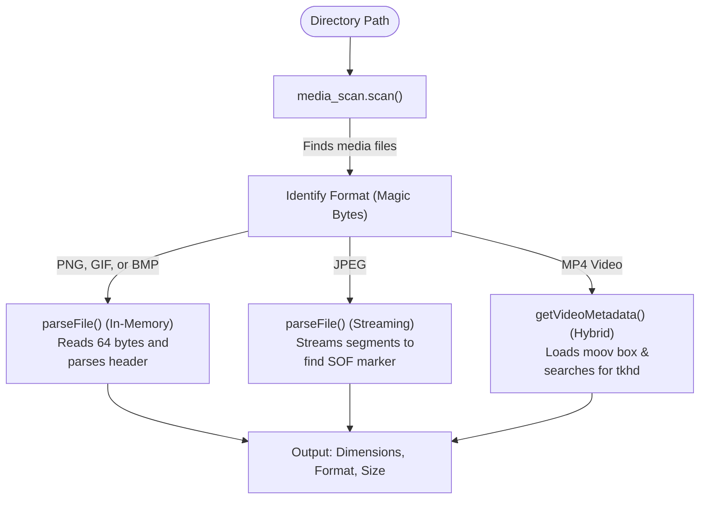

# zprobe: Media Scanner and Metadata Parser

A lightweight, zero-dependency command-line utility and library written in Zig for recursively scanning directories and extracting metadata directly from image and video file headers.

Supported formats:

* **Images:** JPEG, PNG, GIF, BMP
* **Videos:** MP4 (including `.mp4`, `.mov`, `.m4v`)

## Getting Started

Please check that **Zig 0.16.0** is installed on your system.

```bash
# Run the test suite
zig build test

# Build the executable in ReleaseSafe mode
zig build -OReleaseSafe

# Run zprobe on a directory
./zig-out/bin/zprobe /path/to/media/directory

# Run in JSON mode
./zig-out/bin/zprobe --json /path/to/media/directory
```

## Project Architecture

This application scans a target directory recursively for media files, parses their binary headers, and outputs metadata (dimensions, file formats, and sizes) as plain text or structured JSON.

### Module Breakdown

* **[main.zig](src/main.zig):** The command-line entry point. Handles argument parsing (`--json`), absolute path resolution, results orchestration, and stdout output buffering using a custom file writer.
* **[media_scan.zig](src/media_scan.zig):** Core filesystem crawler. Utilizes `std.Io.Dir.walk` to recursively locate files and filter them using lightweight, allocation-free extension matching.
* **[image_meta.zig](src/image_meta.zig):** Contains binary parsers for image headers:
    * *In-Memory Header Parsers:* Reads the first 64 bytes to extract details from **PNG** (IHDR chunk), **GIF** (Logical Screen Descriptor), and **BMP** (DIB header).
    * *Streaming Parser:* Streams **JPEG** files segment-by-segment to dynamically find the Start-of-Frame (SOF) marker without loading the whole image into memory.
* **[video_meta.zig](src/video_meta.zig):** Parser for **MP4 (ISOBMFF)** video metadata. Performs a linear scan of container boxes, locates and loads the metadata container (`moov`), and recursively traverses it to read the track header (`tkhd`) dimensions.
* **[root.zig](src/root.zig):** Library root file exporting the public API modules.

### Architectural Patterns



1. **Explicit Memory Allocation:** All heap allocation is explicit. If any step fails during parsing or directory iteration, Zig's `errdefer` mechanism ensures allocated paths and buffers are completely freed.
2. **Zero-Copy / Small Buffer Parsing:** Images with fixed metadata offsets (PNG/GIF/BMP) are parsed in-memory from a single 64-byte file read. JPEGs and MP4 files are parsed using positional streaming (`readPositionalAll`) to avoid loading large payloads (like video streams or image data) into memory.
3. **Endianness Handling:** Explicit big-endian shifting is used for JPEG, PNG, and MP4 structures, while little-endian decoding is used for BMP and GIF structures.
