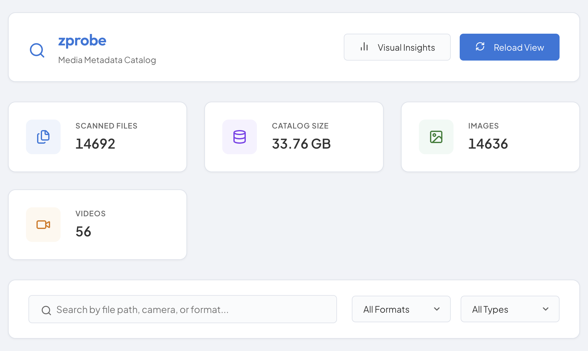

# zprobe

A lightweight, zero-dependency media toolkit written in Zig for recursively scanning directories and extracting dimensions, format, and metadata directly from image and video file headers.

The project ships as two focused binaries: `zprobe` for fast CLI scanning and metadata extraction, and `zprobe-server` for browsing cached results through a local web dashboard.

Most media metadata tools are bloated and not built for constrained environments like a NAS or Raspberry Pi. `zprobe` takes a deliberate approach: read raw binary headers, manage memory explicitly, and compile to many targets without external toolchains. SQLite-backed caching enables near-instant incremental scans, while `zprobe-server` turns that same cache into an interactive catalog for search and filtering. The result is two self-contained binaries with no runtime dependencies, in the spirit of classic Unix utilities like `ls` or `grep`.

See the [User Guide](USERGUIDE.md) and [Developer & Agent Guide](AGENTS.md) to dive deeper.

## Dashboard Preview



> Live dashboard view backed by the SQLite metadata cache, with instant filters for format and media type.

## Usage

```bash
# Scan multiple directories and display metadata
zprobe /path/to/photo /path/to/video

# Scan with SQLite metadata caching enabled
zprobe --db /path/to/cache.db /path/to/photo

# Start the dashboard web server
zprobe-server --port 8080 --db /path/to/cache.db

# Show CLI options and supported formats
zprobe --help
```

## Supported Formats

| Format | Dimensions | Duration | Orientation |
| ------ | ---------- | -------- | ----------- |
| JPEG   | Yes        | No       | Yes         |
| PNG    | Yes        | No       | No          |
| GIF    | Yes        | No       | No          |
| BMP    | Yes        | No       | No          |
| WebP   | Yes        | No       | Yes         |
| TIFF   | Yes        | No       | Yes         |
| AVIF   | Yes        | No       | No          |
| ICO    | Yes        | No       | No          |
| JXL    | Yes        | No       | No          |
| MP4    | Yes        | Yes      | Yes         |
| MOV    | Yes        | Yes      | Yes         |
| WebM   | Yes        | Yes      | No          |
| MKV    | Yes        | Yes      | No          |
