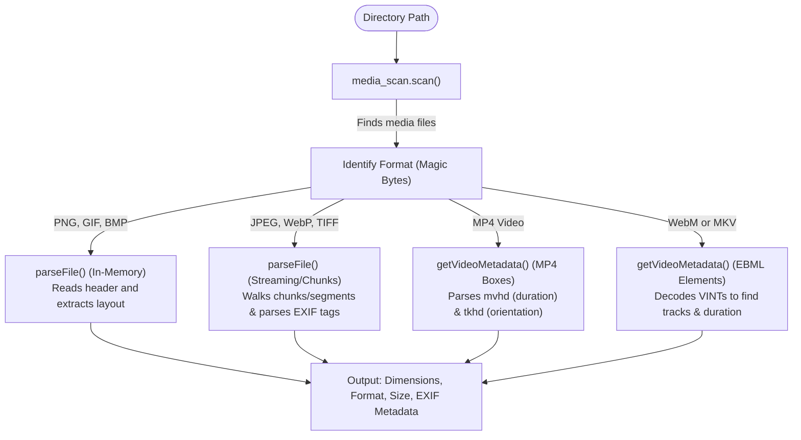

# zprobe: Media Scanner and Metadata Parser

A lightweight, zero-dependency command-line utility and library written in Zig for recursively scanning directories and extracting layout, format, and metadata directly from image and video file headers.

## Supported Formats & Metadata

| Media Category | File Formats | Extracted Metadata |
| :--- | :--- | :--- |
| **Images** | **JPEG**, **PNG**, **GIF**, **BMP**, **WebP**, **TIFF** | Dimensions (Width/Height), Format, Orientation, Capture Date/Time, Camera Make/Model, GPS Latitude/Longitude (EXIF) |
| **Videos** | **MP4** (including `.mov`, `.m4v`), **WebM**, **Matroska (MKV)** | Dimensions (Width/Height), Format, Duration (seconds), Orientation/Rotation, Creation Date/Time |

---

## Getting Started

Please check that **Zig 0.16.0** is installed on your system.

```bash
# Run the test suite
zig build test

# Build the executable in ReleaseSafe mode
zig build -OReleaseSafe

# Run zprobe on a directory
./zig-out/bin/zprobe /path/to/media/directory

# Run in JSON mode
./zig-out/bin/zprobe --json /path/to/media/directory
```

---

## Project Architecture

`zprobe` scans a target directory recursively for media files, parses their binary headers, and outputs metadata (dimensions, file formats, and sizes) as plain text or structured JSON.

### Directory Structure

* **`src/root.zig`**: Library root exporting public modules (`media_scan`, `image_meta`, `video_meta`, `byte_reader`).
* **`src/main.zig`**: CLI entrypoint. Handles argument parsing, path resolution, stdout output buffering, and JSON formatting.
* **`src/core/`**
  * **[byte_reader.zig](src/core/byte_reader.zig)**: A bounded, endian-aware binary reader structure (`ByteReader`) with bounds checking, sub-reader creation, and primitives for parsing nested format structures.
  * **[utils.zig](src/core/utils.zig)**: Helper utilities, including Hinnant's civil time algorithm to format unix timestamps.
* **`src/crawler/`**
  * **[media_scan.zig](src/crawler/media_scan.zig)**: Core filesystem scanner using `std.Io.Dir.walk` to recursively locate media files with allocation-free extension matching. Supports O(1) memory complexity streaming via a callback API.
* **`src/formats/`**
  * **`images/`**: Binary parsers for image files.
    * **[common.zig](src/formats/images/common.zig)**: Image metadata schema, type dispatching, and file parser entrypoint.
    * **[bmp.zig](src/formats/images/bmp.zig)**, **[gif.zig](src/formats/images/gif.zig)**, **[png.zig](src/formats/images/png.zig)**: In-memory header parsers extracting metadata from fixed offsets.
    * **[jpeg.zig](src/formats/images/jpeg.zig)**: Segment-by-segment streaming parser that searches for SOF markers and parses EXIF segments.
    * **[tiff.zig](src/formats/images/tiff.zig)**: IFD (Image File Directory) parser supporting orientation, camera, and GPS tag extraction.
    * **[webp.zig](src/formats/images/webp.zig)**: WebP chunk scanner parsing VP8, VP8L, VP8X headers and EXIF metadata.
  * **`videos/`**: Binary parsers for video containers.
    * **[common.zig](src/formats/videos/common.zig)**: Video metadata schema, type dispatching, and file parser entrypoint.
    * **[mp4.zig](src/formats/videos/mp4.zig)**: ISO Base Media File Format parser. Performs box traversal to extract `mvhd` (creation time, duration) and `tkhd` (dimensions, orientation matrix) boxes.
    * **[ebml.zig](src/formats/videos/ebml.zig)**: EBML (Extensible Binary Meta Language) parser used to extract track layout and duration from **MKV** and **WebM** files.

### Parse Flow



### Key Design Principles

1. **Explicit Memory Allocation**: All heap allocation is explicit. If any step fails during parsing or directory iteration, Zig's `errdefer` mechanism ensures allocated paths and buffers are completely freed.
2. **Bounds Protection**: All parsing leverages `ByteReader` which performs bounds checking on every read/skip operation, avoiding vulnerabilities like buffer overflows on malformed inputs.
3. **Zero-Copy / Small Buffer Parsing**: Fixed-header formats (PNG/GIF/BMP) are parsed using a single small read. Streaming formats (JPEG, MP4, EBML) are traversed dynamically using positional reads (`readPositionalAll`) to avoid loading large media streams into memory.
