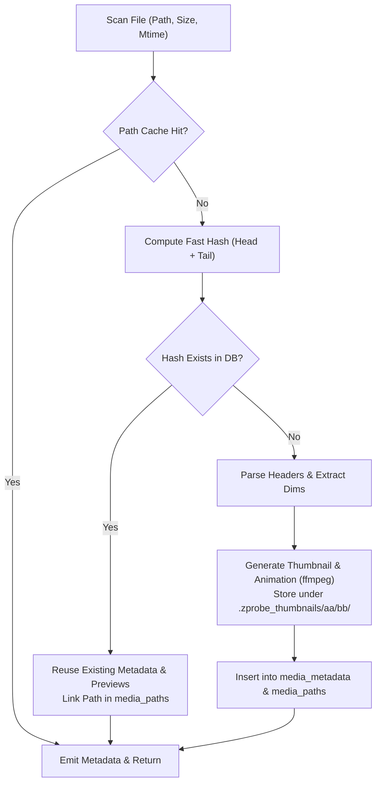

# Engineering Learnings: Content-Keyed Artifacts & Caching

## Context & The Duplication Problem

Media libraries frequently contain duplicate or renamed files across directories.

In naive media management systems, thumbnails and animations are generated and keyed by **file path**:

- **Redundant Transcoding**: ffmpeg re-encodes identical videos stored at different paths.
- **Wasted Storage**: Duplicate JPEG posters and GIF previews multiply on disk.
- **Orphaned Artifacts**: Moving or renaming a file leaves stale artifacts while triggering re-generation.

`zprobe` solves this by decoupling artifacts from filesystem paths and anchoring them strictly to **content-addressed signatures**.

---

## Fast Content Hashing: `computeFastHash`

Hashing full multi-gigabyte video files with SHA-256 is I/O-bound and slow. To identify duplicates rapidly, [`src/core/hashing.zig`](file:///Users/samhuang/Playground/projects/zprobe/src/core/hashing.zig) implements a multi-tiered hashing strategy:

$$\text{FastHash} = \begin{cases} \text{SHA256}(\text{Entire File}) & \text{if size} < 2\text{ MB} \\ \text{SHA256}(\text{Size}_{u64} \parallel \text{Head}_{100\text{KB}} \parallel \text{Tail}_{100\text{KB}}) & \text{if size} \ge 2\text{ MB} \end{cases}$$

```zig
pub fn computeFastHash(io: std.Io, allocator: std.mem.Allocator, file_path: []const u8) ![]const u8 {
    const file = try std.Io.Dir.openFileAbsolute(io, file_path, .{ .mode = .read_only });
    defer std.Io.File.close(file, io);

    const size = try std.Io.File.length(file, io);
    var hasher = std.crypto.hash.sha2.Sha256.init(.{});

    // 1. Hash the file size (little-endian u64)
    var size_buf: [8]u8 = undefined;
    std.mem.writeInt(u64, &size_buf, size, .little);
    hasher.update(&size_buf);

    // 2. Hash contents
    if (size < 2 * 1024 * 1024) {
        // Read small files sequentially
        const file_buf = try allocator.alloc(u8, size);
        defer allocator.free(file_buf);
        const bytes_read = try std.Io.File.readPositionalAll(file, io, file_buf, 0);
        hasher.update(file_buf[0..bytes_read]);
    } else {
        // Read head 100KB
        const chunk_size = 100 * 1024;
        var head_buf: [chunk_size]u8 = undefined;
        const head_read = try std.Io.File.readPositionalAll(file, io, &head_buf, 0);
        hasher.update(head_buf[0..head_read]);

        // Read tail 100KB
        var tail_buf: [chunk_size]u8 = undefined;
        const tail_pos = size - chunk_size;
        const tail_read = try std.Io.File.readPositionalAll(file, io, &tail_buf, tail_pos);
        hasher.update(tail_buf[0..tail_read]);
    }

    var hash_bytes: [std.crypto.hash.sha2.Sha256.digest_length]u8 = undefined;
    hasher.final(&hash_bytes);
    const hex = std.fmt.bytesToHex(hash_bytes, .lower);
    return try allocator.dupe(u8, &hex);
}
```

### Why This Works

- **Head 100KB**: Captures container headers, EXIF blocks, and initial frame bytes.
- **Tail 100KB**: Captures index tables, trailing `moov` atoms, and container footers.
- **File Size ($u64$)**: Distinguishes files that share identical headers or padding.
- **Performance**: Reading $200\text{ KB}$ takes under $1\text{ ms}$ even on network drives or mechanical disks, achieving hundreds of file hashes per second per core.

---

## Sharded On-Disk Artifact Layout

Generated thumbnails and animated previews are stored under hidden directories in the scan target:

- Thumbnails: `.zprobe_thumbnails/`
- Animated Previews: `.zprobe_animations/`

### Two-Level Hex Sharding

Placing tens of thousands of images in a single directory degrades filesystem performance (e.g. directory index limits and slow `stat` operations in ext4 and APFS).

`zprobe` shards artifacts by the first 4 hex characters of the 64-hex lowercase content hash:

```text
.zprobe_thumbnails/
├── 3a/
│   └── 7f/
│       └── 3a7f9c2d...8b1e.jpg
└── e4/
    └── 12/
        └── e412bc88...40aa.jpg

.zprobe_animations/
└── 3a/
    └── 7f/
        └── 3a7f9c2d...8b1e.gif
```

- **Directory structure**: `.zprobe_thumbnails/<aa>/<bb>/<file_hash>.jpg`
- **Parent directory creation**: Writers always invoke `createDirPath` for the `aa/bb` parent tree before writing.
- **Deduplication**: If 5 identical $2\text{ GB}$ videos exist at different paths, they produce the exact same `file_hash`. Only one JPEG poster and one GIF animation are stored on disk.

---

## Lifecycle in the Concurrent Worker Pool

When a worker processes a file in [`src/cli/worker_pool.zig`](file:///Users/samhuang/Playground/projects/zprobe/src/cli/worker_pool.zig#L365-L395):



### 1. The Duplicate-Content Hit

When `queryHashRecord` finds an existing `file_hash` in SQLite:

- Video dimensions, durations, and rotation angles are reused immediately.
- If the thumbnail or animated preview already exists on disk under `.zprobe_thumbnails/aa/bb/<hash>.jpg`, no transcoding is triggered.
- A new reference is inserted into `media_paths` pointing to the existing `media_metadata` row.

### 2. Disk Ground Truth ("Never claim without a stat")

Database flags (`has_thumbnail`, `has_animated`) are never trusted blindly without filesystem verification.

- Before reporting `has_thumbnail = true`, `checkThumbnailExists` performs a physical `stat` on `.zprobe_thumbnails/aa/bb/<hash>.jpg`.
- If a user manually deleted thumbnail directories, `zprobe` detects the missing file and heals it dynamically.

### 3. Concurrent Worker Sibling Re-Stat

When multiple workers process duplicate files simultaneously:

```zig
reStatSiblingArtifacts(c_ctx, allocator, file_hash, is_video, &has_thumb, &has_animated);
```

Workers write artifacts using atomic temporary files (`.tmp`) and renames. If a sibling worker finished generating the shared artifact while another worker was verifying it, the sibling re-stat ensures the flag is correctly recorded without duplicate work.

---

## Animated Previews with Native ffmpeg Palette Pipeline

For video files, animated GIF previews are generated using ffmpeg's two-pass palette filter pipeline:

```bash
ffmpeg -y -ss 00:00:01 -t 3 -i input.mp4 \
  -vf "fps=10,scale=320:-1:flags=lanczos,palettegen" palette.png

ffmpeg -y -ss 00:00:01 -t 3 -i input.mp4 -i palette.png \
  -filter_complex "fps=10,scale=320:-1:flags=lanczos[x];[x][1:v]paletteuse" preview.gif
```

- Generates crisp, high-quality color palettes tailored to the specific video clip.
- Throttled via a worker-pool semaphore (`ffmpeg_sem`) to prevent CPU exhaustion.

---

## Summary of Caching & Artifact Rules

1. **Key all artifacts by content hash, never by file path**: Guarantees automatic deduplication and persistence across file renames.
2. **Use fast chunked hashing for files $\ge 2$MB**: Combine size + head 100KB + tail 100KB for sub-millisecond SHA-256 signatures.
3. **Shard disk directories with `<aa>/<bb>/`**: Prevent filesystem performance degradation on large media catalogs.
4. **Always verify disk existence**: Treat the filesystem as ground truth; heal missing artifacts automatically.
5. **Serialize external transcoders**: Use semaphores to constrain concurrent ffmpeg processes to available CPU capacity.
