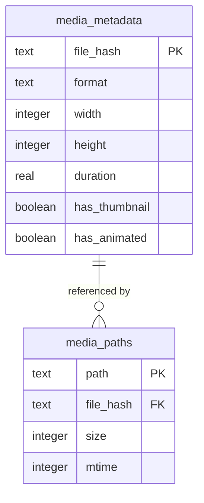

# Engineering Learnings: SQLite WAL & Worker Concurrency

## Context & The Concurrency Challenge

`zprobe` operates both as a high-speed CLI crawler and an embedded web dashboard server:
1. **CLI Crawler**: Concurrent workers check caches, compute hashes, and insert media records.
2. **HTTP Server**: Web clients query media lists, filter catalogs, and request thumbnails simultaneously.

In standard SQLite configuration, a write operation acquires an exclusive database lock, blocking all concurrent readers with `SQLITE_BUSY` errors. Conversely, an active reader blocks incoming writes.

To achieve lock-free concurrent reads during heavy crawler indexing, `zprobe` employs a multi-tiered concurrency design.

---

## The SQLite Configuration

When initializing the database connection in `src/core/db/schema.zig`, the following pragmas are enforced:

```sql
PRAGMA journal_mode = WAL;
PRAGMA synchronous = NORMAL;
PRAGMA foreign_keys = ON;
```

### 1. Write-Ahead Logging (`WAL` Mode)
In `WAL` mode, changes are written to a separate `-wal` file rather than modifying the main database directly.
* **Non-blocking concurrent reads**: Readers access consistent snapshots of the database while a writer commits changes to the WAL file.
* **High-frequency inserts**: Appending to the WAL is sequential, significantly accelerating transaction commits during batch crawling.

### 2. Busy Timeout (5000ms)
To handle transient contention when committing transactions or checkpoints, `zprobe` registers a busy handler:
```zig
_ = c.sqlite3_busy_timeout(handle, 5000);
```
If a writer lock is held, other operations automatically retry for up to 5 seconds before failing, absorbing temporary spikes in write traffic.

---

## Application-Level Synchronization: Shared `RwLock`

While SQLite's `WAL` mode allows multi-process concurrency, calling SQLite API functions on a single database handle across multiple threads without synchronization can lead to memory corruption.

In `src/core/db.zig`, the database wrapper incorporates a reader-writer lock:

```zig
pub const Db = struct {
    ...
    handle: ?*c.sqlite3,
    rwlock: std.Io.RwLock = std.Io.RwLock.init,
    ...
};
```

### Read Locking (`lockRead` / `unlockRead`)
Used for cache queries, hash lookups, and dashboard catalog reads:
```zig
pub fn lockRead(self: *Db, io: std.Io) void {
    self.rwlock.lockSharedUncancelable(io);
}

pub fn unlockRead(self: *Db, io: std.Io) void {
    self.rwlock.unlockShared(io);
}
```
Multiple worker threads and web request handlers can execute read queries simultaneously without waiting on one another.

### Write Locking (`lockWrite` / `unlockWrite`)
Used for inserting media records, updating thumbnail flags, and running prune transactions:
```zig
pub fn lockWrite(self: *Db, io: std.Io) void {
    self.rwlock.lockExclusiveUncancelable(io);
}

pub fn unlockWrite(self: *Db, io: std.Io) void {
    self.rwlock.unlockExclusive(io);
}
```
Only one writer executes at a time, ensuring serialized, corruption-free SQLite transactions.

---

## Relational Schema & Decoupled Caching

To prevent data duplication and support fast deduplication across file paths, `zprobe` decouples metadata from physical filesystem locations:



### 1. Foreign Key Cascading Triggers
When duplicate files share the same content hash, they share a single row in `media_metadata`. When a path is removed, custom triggers in `src/core/db/schema.zig` clean up orphaned metadata rows automatically:

```sql
CREATE TRIGGER IF NOT EXISTS cleanup_orphan_metadata
AFTER DELETE ON media_paths
FOR EACH ROW
WHEN (SELECT COUNT(*) FROM media_paths WHERE file_hash = OLD.file_hash) = 0
BEGIN
    DELETE FROM media_metadata WHERE file_hash = OLD.file_hash;
END;
```

### 2. Transactional Stale-Path Pruning (`--prune`)
When `--prune` is passed to the CLI scanner, `zprobe` reconciles the database with the filesystem in a single atomic transaction:
1. Compares scanned active paths against paths recorded in `media_paths`.
2. Emits `DELETE FROM media_paths WHERE path = ?` inside a transaction block.
3. Triggers automatically clean up orphaned metadata rows.

---

## In-Memory Stats Caching with Short TTL

Computing catalog summary statistics requires full-table aggregation queries:
```sql
SELECT format, COUNT(*), SUM(size) FROM media_paths JOIN media_metadata GROUP BY format;
```
If every dashboard page load or search keystroke re-ran these aggregate queries, SQLite would spend unnecessary CPU cycles scanning rows.

In `src/core/db.zig`, `zprobe` caches the aggregated `DbStats` in memory with a **2-second TTL**:
* If requests arrive within 2 seconds, the cached `DbStats` struct is served immediately from RAM.
* If 2 seconds have elapsed, the lock is acquired, the previous arena is wiped, and a single pass query repopulates the cache.

---

## Summary of Concurrency Guidelines

1. **Always enable WAL mode**: `PRAGMA journal_mode = WAL;` is essential for concurrent reader/writer workloads.
2. **Set a busy timeout**: A 5-second busy timeout prevents `SQLITE_BUSY` errors during checkpointing and batch transactions.
3. **Use shared `RwLock` for database handles**: Multiple threads sharing a handle must use shared locks for reads and exclusive locks for writes.
4. **Decouple content from path**: Key metadata by `file_hash` and physical paths by `path` to avoid duplicate data storage.
5. **Use triggers for automatic garbage collection**: Automatically prune orphaned metadata when path entries are deleted.
